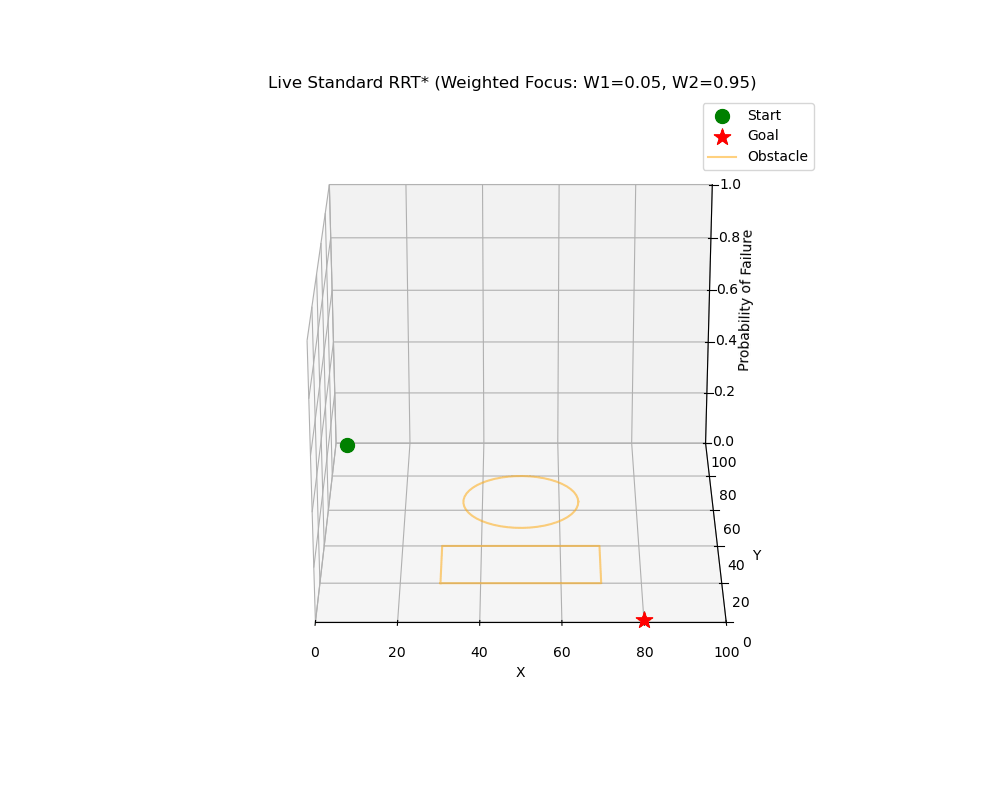
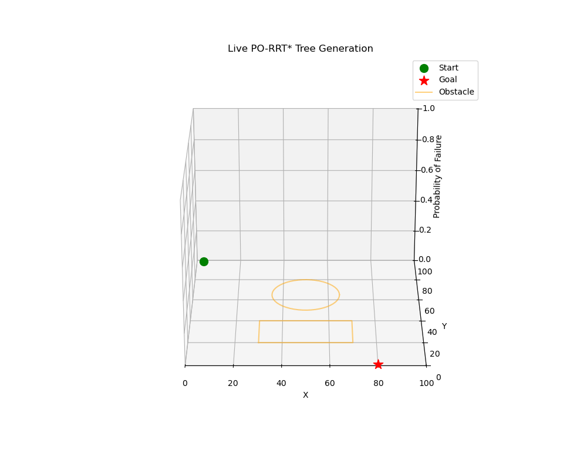
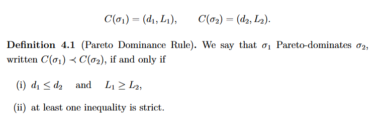
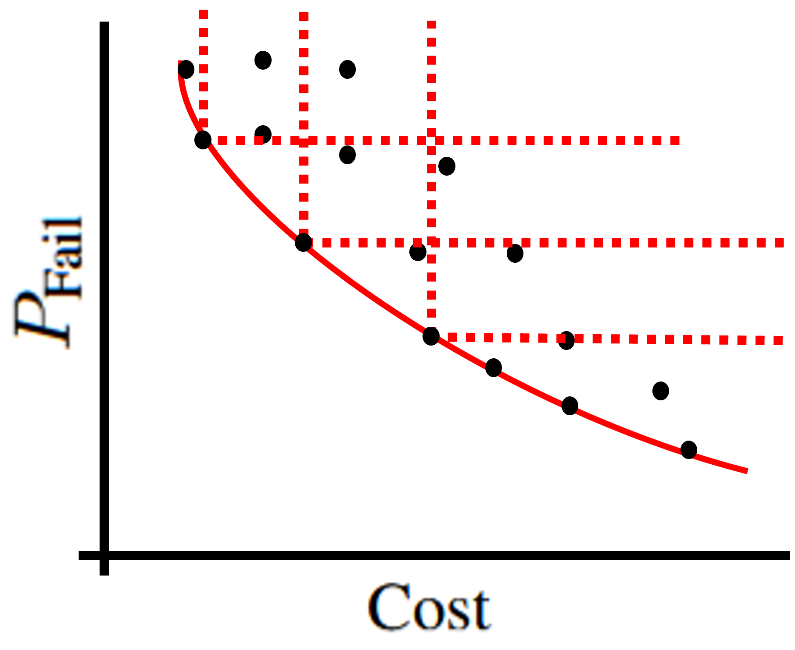

# PO-RRT*: Pareto-Optimal RRT* for Multi-Objective Path Planning

**PO-RRT*** is an optimal, multi-objective motion planning algorithm. Traditional RRT* algorithms force competing objectives (e.g., minimizing travel distance vs. navigating risk zones) into a single scalar weight, hiding the true values of each individual objective. This framework abandons scalar weights entirely. Instead, it computes and preserves the **complete set of non-dominated trade-off trajectories (the Pareto frontier)** in real-time, allowing an autonomous agent (or human operator) to dynamically select the best path post-computation.

### Baseline RRT* (Weighted) vs. PO-RRT*
| Standard RRT* (Scalar Focus) | PO-RRT* (Multi-Objective) |
| :---: | :---: |
|  |  |
| *Standard RRT\* where the cost is scalarized and both objectives are given specific weight. Not enough weight was given to Risk, thus the algorithm fails to capture alternate safe routes.* | *Explores and preserves the entire Pareto frontier, finding multiple trade-off paths simultaneously.* |

---

## Key Algorithmic & Architectural Contributions

Transitioning this concept from a mathematical theory to a viable software implementaion required solving several severe computational bottlenecks:

* **Vectorized Array Architecture:** Transitioned the core graph data structure from a memory-heavy object-cloning model to a vectorized NumPy array architecture. Geometric spatial nodes store multi-objective trajectories internally as matrices, drastically reducing instantiation overhead and memory bloat.
* **True Lazy-Evaluation Pipeline:** Engineered an on-demand, recursive task queue. Metric propagation and graph rewiring are completely decoupled from geometric exploration. Nodes only synchronize their mathematical states when actively queried by the spatial KD-Tree.
* **Tensor-Broadcasted Pareto Filtering:** Replaced millions of redundant scalar dominance checks with tensor-broadcasting. Cost matrices are evaluated and pruned in bulk, mathematically strangling dead paths before they can propagate through the network.
* **Cyclic Graph Resolution:** Solved the complex bidirectional lineage problem inherent to multi-objective spanning trees (where nodes can act as mutual parents for different trade-off paths) by implementing recursion locks to prevent stack overflows.
* **Optimized Spatial Querying:** Integrated SciPy's `cKDTree` with dynamic radius scaling to maintain rapid nearest-neighbor queries as the configuration space scales to thousands of vertices.

---

## Core Concept: Pareto-Dominance & Safety

When working with autonomous agents, safety is often overlooked in favor of efficiency. To provide more trust in human-robot interaction, risk must be explicitly measured, not just bundled into a cost function.

In this environment, known and unknown areas of the workspace are assigned a probability of being occupied (an occupancy grid). Because we detach our **Probability of Failure (`p_fail`)** from the overall **Cost**, our agent takes on an augmented multi-dimensional state. 

We say that a potential path Pareto-dominates another if and only if it is better or equal in all objectives, and strictly better in at least one:

### The Pareto Front
By enforcing this dominance check at every node via our array architecture, we generate a "front" of non-dominated paths. 

*The dotted lines represent the dominance region. If a newly discovered path falls into the lower-left region (lower cost, lower risk), the older paths are mathematically dominated, pruned from the array, and deleted from the graph.*

---

## Visual Results & Benchmarking

The resulting paths offer a distinct choice between the shortest, riskiest path and the longest, safest path—and every mathematically optimal compromise in between.

| Pareto Front Scatter | Angled View (Distance vs Risk) |
| :---: | :---: |
|  |  |

