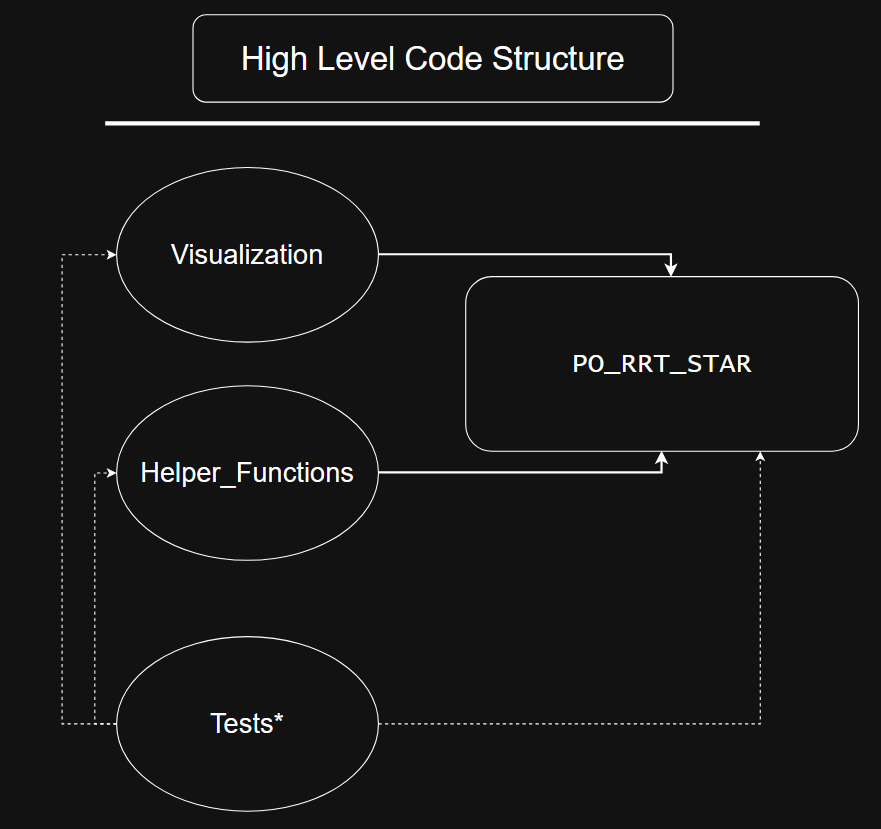

# Main Setup Guide for Framework
This setup_guide will function as a walkthrough on how to install this framework on your machine using a virtual conda environment. The beginning of this tutorial will go through the basics on downloading the files and creating the environment. Once this first step is complete, this guide will dive into how to use the code properly. 

- `README.md`: Introduction to the Github repo, research, and algorithm.
- `setup_guide.md`: Main tutorial on how to install the repo (specifically through conda) and troubleshooting.
- `src folder`: Contains the main code for our PO-RRT* algorithm and supporting tools.
- `tests folder`: Contains the test functions to be used with Pytest. This ensures proper operation of our code.
- `imgs folder`: Contains graphics used in these guides. Does not contain algorithm-related material.
- `GenAIuse.txt`: Contains the statement describing how AI was used for this research.
- `pyproject.toml`: Contains all the requirements for getting the library setup.

## Getting Started
When cloning this repo, you will have a general `src` (source) folder with all the primary files within it. The `tests` folder contains over 40 Pytest functions that are used in troubleshooting and verification of the code. `README.md`, `setup_guide.md`, and `pyproject.toml` will be in the base directory next to the `src` folder. The rest of the setup for this should be fairly straightforward.

We are going to create a new conda environment for this code for ease of use and to better keep track of all dependencies. Explicitly setting up a virtual environment ensures that future library installations will not be affected by our code today.

If you do not have conda installed on your computer, please visit the website below and follow all the instructions on setting up Miniconda. If you have a dedicated virtual environment already running or have a different preference, you may use that instead. Additionally, installing a virtual environment is not a hard requirement for this framework to run, it simply consolidates everything neatly into one location and has fewer errors when running. Alternatively, you may download the raw zip file from github and directly run the python file in the source folder.

Miniconda download: https://www.anaconda.com/docs/getting-started/miniconda/main

Once miniconda is set up on your computer, please follow the commands below to create your conda environment.

### Conda Environment Setup

Begin by setting up a conda or mamba environment:
```bash
conda create --name po-rrt-env python=3.12.9
```
Once the environment has been created, activate it:

```bash
conda activate po-rrt-env
```
Double check that python is version 3.12 in the environment:
```bash
python --version
```
Ensure that pip is using the most up to date version of setuptools:
```bash
pip install --upgrade pip setuptools wheel
```
If you have a folder from which you are working from, please navigate there now. Otherwise, create a new folder to clone this repo and then navigate into it:
```bash
mkdir PO-RRT-Repo
cd PO-RRT-Repo
```
We need to git clone the original repo and then navigate to the PO-RRT-Repo to install all the pre-requisites. In your terminal, please write the following:
```bash
git clone https://github.com/K-batonisashvili/PO-RRT-Pareto-Optimal-Path-Planning.git
```
Once you clone the directory, lets navigate to the appropriate sub-directory. Your path should look similar to this:
```bash
cd ./PO-RRT-Pareto-Optimal-Path-Planning
```
Finally, with this pip install command, we will download all required packages and dependencies into your conda environment:
```bash
pip install -e .
```
Thats it!

### TROUBLESHOOTING: If you encounter "helper functions module not available" or "visualization module not available"

If your code is running into issues where errors display a message similar to "unable to find library", that might mean one of 2 things, please try both fixes.

1) Make sure your conda environment is activated in the terminal. Please do so by typing `conda activate po-rrt-env` in your terminal. Then run the command `conda list` which should include the po-rrt-env library.
2) When running in VScode directly, please make sure that your interpreter for the Jupyter Notebook is running the conda environment instance. In VScode, press CTRL SHIFT P and type in "interpreter" and go through the menu to select your conda env.


NOTE: If you chose to download the raw zip from github without installing the virtual library, you might need to shuffle your files around to make this work. We found it easiest to combine the 3 files into 1 central python file and running it directly.

## Tutorial Deep Dive

In this part of the setup guide, we will examine how our code functions, the potential modifications, applications, edge cases, and more. 


### Code Structure

Lets take a quick look at how the 3 main source files communicate with each other. `PO_RRT_Star.py` is our primary python file where our algorithm is stored. This file calls on visualization.py and helper_functions.py which contain their relevant functionality, creating plots and mathematical calculations, respectively. Our tests* folder contains several Pytest cases used while developing our code. You may browse through these test cases, edit current ones, or add new ones. These tests call on all three source files depending on necessity and the nature of the test itself. This code structure may be seen in the high-level overview flowchart below.  

